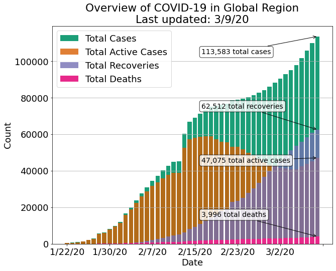
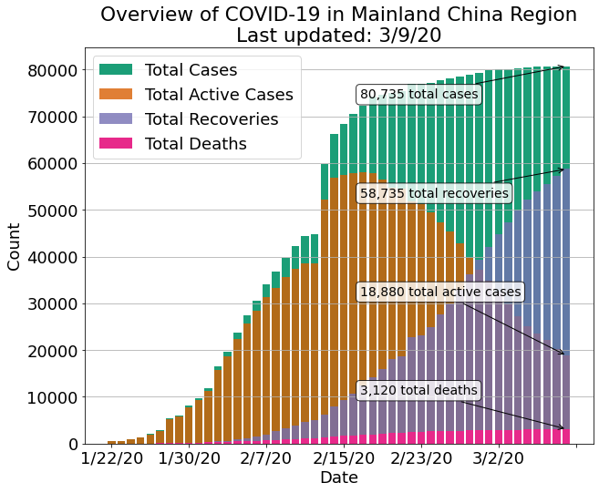
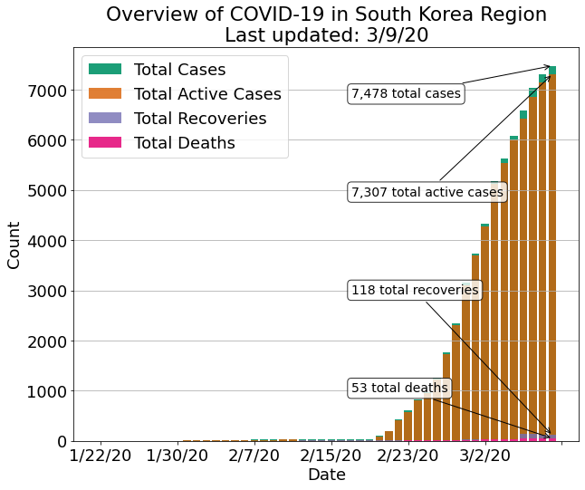
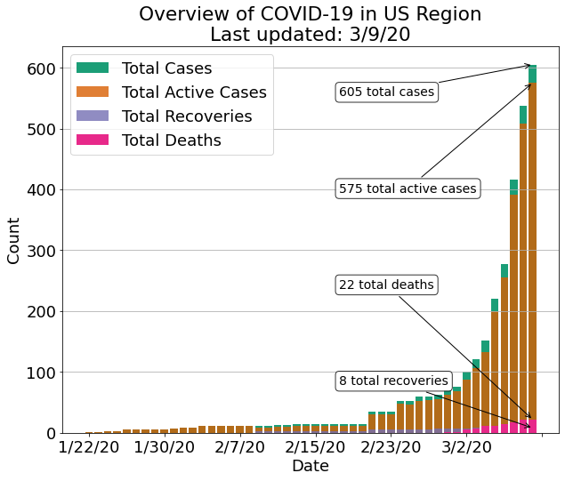
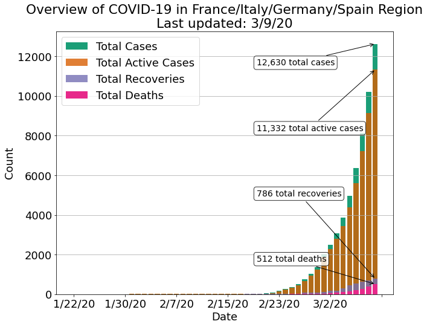
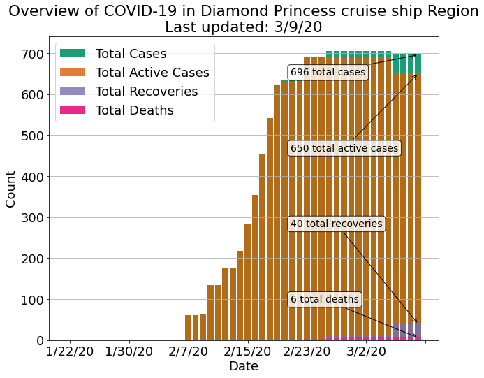
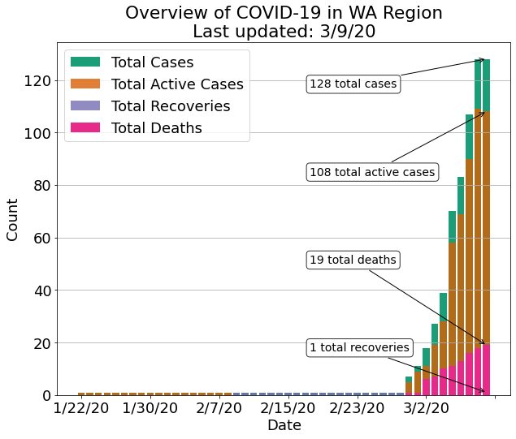
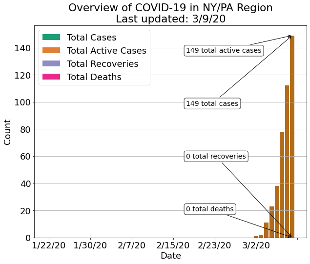
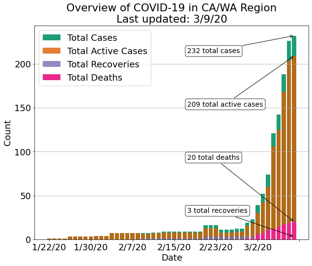

# COVID-19-pyvis
Pulls the latest COVID-19 data and provides a few Python functions to plot time-series data for different kinds of regions: Countries, States, and Counties.

It automatically interfaces with a <a href="https://github.com/CSSEGISandData/COVID-19">repo of daily time-series data</a> maintained by the JHU CSSE</a>
# Installation

This module depends on a submodule. Thus, the easiest thing to do is clone it like so:

`git clone --recursive https://github.com:nrhine1/covid-19-pyvis` <br>

Then, install the requirements

`pip3 install -r requirements.txt`

Tested with Python 3.7.0 on MacOS. I recommend you use a virtualenv or create a conda env.

e.g. 
```virtualenv -p `which python3` covidpy; 
source covidpy/bin/activate; 
pip install -r requirements.txt```

# Usage
See the [jupyter notebook](covid-19-analysis/notebooks/overview_plotting_example.ipynb) for a walkthrough.

The core functionality is currently provided by several functions defined therein:

- `plot_regions([list of country or region names])`
- `plot_states([list of US state two-letter codes])`
- `plot_counties([list of US county names])`.

# Examples:
## Plot worldwide summary.
`plot_regions(region_names=regions)`<br>


## Plot data for a few specific countries:
`plot_regions(['Mainland China'])`<br>


`plot_regions(['South Korea'])`<br>


`plot_regions(['US'])`<br>


## Aggregate across several countries:
`plot_regions(['France', 'Italy', 'Germany', 'Spain'])`<br>


## Sometimes the data stores special cases as "Regions", like the Diamond Princess Cruise Ship:
`plot_regions(["Diamond Princess cruise ship"])`<br>


## Plot data for a specific state in the United States:
`plot_states(['WA'])`<br>


## Aggregate across a few states
`plot_states(['NY', 'PA'])`<br>


`plot_states(['CA', 'WA'])`<br>


